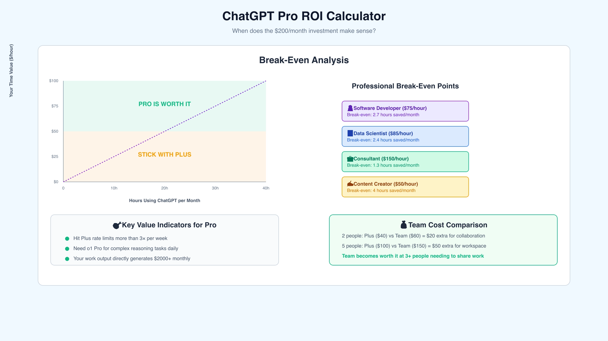
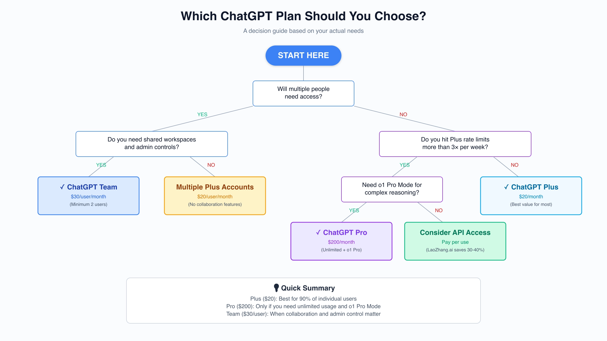

# ChatGPT Pro 和 Team 怎么选？2025 年这份对比帮你省钱

你可能已经注意到，ChatGPT 的订阅价格跨度大得离谱——从每月 20 美元的 Plus 到 200 美元的 Pro，差了整整 10 倍。Team（现在叫 Business）则卡在中间，每人每月 30 美元。这种定价策略让人困惑：到底多花这些钱能买来什么？更重要的是，你真的需要吗？

我们直接说结论：Pro 适合那些每周多次碰到 Plus 使用限制、并且需要 o1 Pro 模式来处理复杂推理任务的重度个人用户。Team 则是给需要协作功能、管理员控制、以及每 3 小时 100 条消息额度的团队准备的。关键问题不是"哪个更好"，而是"哪个更适合你的实际工作场景"。

---

## 先看价格：这钱到底花在哪了

在讨论是否值得之前，我们得搞清楚你为这些价格差异买单的到底是什么。Plus 到 Pro 的价格跳跃是 10 倍，Team 则比 Plus 贵 50%。理解这些差异是做出明智决策的第一步。

ChatGPT Pro 在 2024 年 12 月推出，定位是高端个人订阅。它最大的卖点是 o1 Pro 模式——这是推理模型的增强版，会用更多计算资源来"更深入地思考"复杂问题。外部测试显示，o1 Pro 模式在常规编码任务中减少了 75% 的错误率，在竞赛级问题上达到 4/4 的可靠性——意思是多次尝试都能稳定给出正确答案。

ChatGPT Team（2025 年 8 月改名为 Business，但功能和价格没变）针对的是完全不同的市场。它是为需要 AI 访问和共享资源的组织设计的。最低起订是两个用户，每月 60 美元——比两个 Plus 订阅贵，但提供了关键的协作功能。

核心区别不只是使用限制，更在于使用场景。Pro 假设你是个人用户，需要把 AI 推到极限来完成复杂专业工作。Team 假设你属于一个需要稳定 AI 访问和组织管理的团队。没有绝对的好坏，只是解决不同的问题。

技术层面的主要差异包括消息限制：Plus 每 3 小时 40-50 条消息，Pro 几乎无限使用，Team 则是 Plus 的两倍，达到 100 条。但单纯的消息数量只是表面。Pro 的真正价值在于 o1 Pro 模式和研究功能，Team 的价值则体现在工作空间管理和共享自定义 GPT 上。

## Pro 值 200 美元吗？让数据说话

每月 200 美元的价格标签足以让大多数人倒吸一口凉气——这确实贵得离谱。但对特定的专业用户来说，它实际上可能省钱。理解这个悖论需要同时审视实际功能和专业 AI 使用的经济现实。

### o1 Pro 模式到底有多强

o1 Pro 模式不是简单的"更好的 GPT-4"营销话术——它是根本不同的推理方法。当你向 o1 Pro 模式提交查询时，模型会使用额外的计算周期在回答前彻底分析问题。想象一下快速问答和花几小时研究后给出全面回复的区别。

在基准测试中，o1 Pro 模式在美国数学邀请赛（AIME）上正确解决了 80% 的问题——这是专为全美前 5% 高中数学生设计的考试。标准 GPT-4 在同一测试上只能达到约 12%。对于编码任务，错误率的降低不是边际改进——而是变革性的。那些用标准模型需要几小时反复调试的复杂问题，在 o1 Pro 模式下往往一次就能解决。

这个模型特别擅长多步推理、数学证明、复杂代码架构，以及需要持续逻辑链条的任务。如果你的工作涉及证明定理、设计算法、分析复杂数据集，或者解决需要同时记住多个约束条件的问题，o1 Pro 模式提供了其他地方找不到的能力。

### Pro 不只是 o1：完整的专业套餐

虽然 o1 Pro 模式是头条功能，Pro 订阅者还获得一整套优势。单是无限使用就能为重度用户证明成本合理性。考虑到雇用人类专家解决复杂问题轻松要价每小时 150-300 美元，如果 Pro 每月通过更快的问题解决为你节省哪怕两小时，你就接近收支平衡了。

Pro 订阅者还在高峰期获得优先访问权——当你急需 AI 帮助赶截止日期，而 Plus 用户面对"系统繁忙"消息时，这个功能的价值就显现出来了。该计划每月包含多达 250 次深度研究运行，AI 可以综合大量在线信息进行全面分析。

提前访问 Sora（AI 视频生成）和高级研究代理等实验性功能，让 Pro 用户站在前沿。虽然这些功能看起来像"锦上添花"，创意产业或研究岗位的专业人士可以在正式发布前几个月就利用它们获得竞争优势。

说到这，如果你确实是那种频繁碰到使用限制、需要最强推理能力的专业用户，不妨看看这个 👉 [ChatGPT Pro 的替代方案：更灵活的 TEAM 会员方案](https://shaoyumi.com/buy/65)，可能更适合你的实际需求和预算。

### 用户评价：褒贬不一的现实

用户社区对 Pro 的价值仍存分歧。最初的评论很热情，许多专业人士声称订阅"几天内就回本了"。然而，一些用户报告性能随时间下降，引发了关于一致性的质疑。一个反复出现的抱怨涉及"无限"的主观性质——虽然没有硬性消息上限，但一些用户报告在极度频繁使用时遭遇限流。

PCWorld 的评测总结说"对大多数用户来说，性价比不足以证明这疯狂的成本"，这一观点在多家科技出版物中得到呼应。共识是 Pro 只对窄众用户群体有意义：那些通过 AI 产生可观收入、持续碰到 Plus 限制，或在 o1 Pro 模式的特定能力能提供可衡量生产力提升的领域工作的人。

## o1 Pro 模式的真实威力（以及谁真正需要它）

理解 o1 Pro 模式需要超越功能列表，审视实际应用。模型"更深入思考"的能力听起来抽象，直到你看到它的实际表现。处理复杂问题时，o1 Pro 模式会明显地处理更长时间——有时 30-60 秒——然后给出展示更深理解和更彻底分析的回复。

### 实战中的性能差异

一个软件开发者在调试分布式系统中的竞态条件时，可能用标准 ChatGPT 花费数小时，却只得到处理症状而非根本原因的建议。o1 Pro 模式能识别微妙的时序依赖，提出从架构层面彻底预防问题的方案。区别不是增量改进——而是表面辅助和专家咨询的分野。

对数据科学家来说，o1 Pro 模式改变了探索性数据分析。它不是建议基础相关性，而是能识别复杂的交互效应，提出精密的特征工程策略，解释标准模型可能忽略的统计异常。一位量化研究员报告说，o1 Pro 模式识别出他们模型中一个数据泄漏问题，而这在数月开发中一直未被注意到。

数学家和理论计算机科学家发现 o1 Pro 模式特别有价值。模型能跟进复杂证明，识别逻辑漏洞，对问题提出替代方法。它不是替代人类创造力，而是增强它——提供一个不知疲倦的合作者来探索数学领域。

### 能证明成本合理的专业场景

**软件工程师和架构师**：设计复杂系统的人受益于 o1 Pro 模式能在上下文中保持整个架构同时评估权衡的能力。如果你在做关于微服务边界、数据库架构或 API 设计的决策，这些将影响你的组织数年，改进的推理质量能防止代价高昂的错误。

**研究人员和学者**：无论是分析研究论文、设计实验还是撰写资助申请，o1 Pro 模式提供博士级别的帮助。模型能综合多篇论文的发现，识别研究空白，提出反映深度领域理解的方法论改进。

**量化分析师和数据科学家**：构建机器学习模型涉及关于特征工程、模型选择和验证策略的众多决策。o1 Pro 模式能整体评估这些选择，同时考虑统计严谨性、计算效率和业务约束。

**内容创作者和作家**：虽然看似技术性较弱，处理复杂主题的专业作家从 o1 Pro 模式在长文档中保持一致性、对照多个来源进行事实核查、以逻辑精确性构建论证的能力中受益。

**顾问和战略专家**：分析商业问题需要考虑多个利益相关者、约束和目标。o1 Pro 模式擅长这种多方面分析，提供考虑表面分析常常忽略的二阶和三阶效应的洞察。

## Pro 还是 Team？谁该选哪个

Pro 和 Team 之间的决策不只是功能问题——而是将投资与你的实际需求和工作流程对齐。许多用户以为自己需要最昂贵的选项，而实际上不同的计划会更适合他们。让我们审视具体场景来澄清决策。

### 何时 Pro 在财务上合理

当你的时薪价值超过 75 美元且 Pro 每月为你节省至少 2.7 小时时，ChatGPT Pro 在经济上变得合理。对于时薪 150 美元的顾问，每月仅节省 1.3 小时就证明了成本合理。但时间节省本身不能说明全部。

考虑一个机器学习工程师在训练模型时每天碰到 Plus 速率限制。等待速率限制重置的生产力损失可能远超每月 200 美元。如果中断使项目交付延迟哪怕一天，Pro 订阅就多次收回成本了。

直接通过 AI 工作产生收入的专业人士面临最清晰的决策。如果你是使用 ChatGPT 加速客户项目的自由开发者，无限使用和优先访问能直接转化为承接更多工作。一位自由职业者报告说，Pro 使他们每月能完成额外 3000 美元的项目，而这用 Plus 的限制是不可能的。

对研究人员和学者来说计算有所不同。那些从事涵盖软件成本的资助项目的人可能轻松将 Pro 证明为研究费用。o1 Pro 模式在文献综述、方法论设计和数据分析方面的能力能显著加速研究。然而，博士后和无资助的研究人员通常发现 API 访问或机构订阅更可持续。

### 何时 Team 提供更好的价值

ChatGPT Team 在协作环境中闪耀，其中总和超过个体部分。每用户每月 30 美元，比 Plus 贵 50%，但协作功能通常为小至三人的团队证明了这个溢价。

营销机构发现 Team 特别有价值。为品牌声音创建自定义 GPT，在文案撰稿人之间共享它们，并在营销活动中保持一致性，提供了超越个人订阅的价值。管理控制台允许项目经理临时为自由职业者配置访问权限，改善安全性和成本控制。

软件开发团队受益于共享的调试助手和代码审查机器人。当每个开发者都能访问根据你的代码库约定训练的相同自定义 GPT 时，代码质量提高而审查时间减少。每 3 小时 100 条消息的限制很少约束在整个工作日间歇使用 AI 的团队成员。

没有专门 IT 人员的小企业欣赏 Team 的简单性。集中计费消除了费用报告的烦恼，而管理控制台提供不需要技术专长的基本用户管理。对于 5 人创业公司，每月支付 150 美元的 Team 通常比管理五个单独订阅更有意义。

教育机构和培训组织利用 Team 的工作空间功能进行结构化学习。教师可以为特定课程创建自定义 GPT，与学生共享，并监控使用模式以识别学习者需要额外支持的地方。

## Team 何时胜过多个 Plus 账户

Team 与多个 Plus 订阅的数学比较并不直接，因为协作功能具有非线性价值。两个 Plus 订阅每月花费 40 美元，而 Team 的最低要求是 60 美元——为协作支付 20 美元溢价。但这个分析忽略了关键的组织利益。

### 个人订阅的隐性成本

管理多个 Plus 订阅产生随规模复合的管理开销。每个用户管理自己的计费，导致费用报告、报销延迟和会计复杂性。当员工离职时，他们的 ChatGPT 知识和自定义 GPT 也随之离开。没有办法转移所有权或保留机构知识。

安全性随个人账户变得棘手。员工可能使用个人邮箱，使得在他们离职时无法撤销访问权限。他们可能共享凭据以规避速率限制，造成安全漏洞。没有集中监督，你无法执行数据处理政策或监控不当使用。

当团队成员无法共享发现时，知识孤岛就会形成。一个开发者可能创建了出色的调试 GPT，而另一个正为类似问题苦苦挣扎。一个营销人员可能开发了完美的品牌声音助手，而同事永远看不到。这些低效在组织中成倍增加，代表远超 Team 溢价的隐性成本。

### 自我回本的协作功能

Team 的工作空间功能改变了组织使用 AI 的方式。自定义 GPT 成为组织资产而非个人工具。当你的销售团队开发出完美捕捉你价值主张的提案生成器时，每个销售人员立即受益。更新即时传播，确保每个人使用最新版本。

管理控制台提供对使用模式的可见性，为培训和资源分配提供信息。如果某些团队成员很少使用他们的配额，你可能发现他们需要培训或不同的工具。相反，重度用户可能受益于 Pro 订阅或额外支持。

共享聊天历史实现知识转移和质量控制。高级团队成员可以审查初级同事的 AI 互动，提供指导并在错误传播之前捕获它们。这种监督在每个用户历史保持私密的个人订阅中是不可能的。

对于受监管行业或处理敏感数据的组织，Team 的企业级安全提供安心。数据不用于模型训练，减少隐私担忧。SAML SSO 集成确保认证符合组织标准。这些功能可能看起来次要，直到数据泄露或合规审计使它们变得关键。

想要更灵活的团队协作方案？这里有个实惠的选择 👉 [TEAM 会员特价方案：适合 3-5 人小团队的最佳选择](https://shaoyumi.com/buy/65)，既能满足协作需求，又不会超预算。

## 你的 ChatGPT 计划决策指南

做出正确选择需要诚实评估你的需求、预算和增长轨迹。以下框架通过按优先级顺序审视关键因素来帮助构建你的决策。

### 第一步：评估当前使用情况

从记录你一周的 ChatGPT Plus 使用情况开始。追踪你多久碰到一次速率限制，你在完成什么任务，以及何时希望有更多能力。如果你目前不是 Plus 订阅者，估计如果不受限制你每天会有多少实质性 AI 互动。

速率限制挫折频率作为主要指标。每周碰到限制一次表明 Plus 足够。每周三次或更多表明你需要 Pro 或 API 访问。每天限制几乎肯定证明 Pro 合理，除非你对价格极度敏感。

### 第二步：计算你的真实时薪价值

你的时薪价值不只是你的工资除以 2080（年度工作小时）。考虑延迟工作的机会成本、更快决策的价值，以及快速迭代的竞争优势。一个年薪 15 万美元的开发者，考虑项目奖金和提高生产力带来的职业进步，可能有 120 美元的有效时薪价值。

自由职业者和顾问应使用他们的计费费率，而不是有效时薪收入。如果你按每小时 100 美元计费但花一半时间在非计费工作上，这个计算的相关费率仍然是 100 美元——Pro 帮助你更快完成计费工作，而不是管理任务。

### 第三步：评估协作需求

即使你主要独立工作，考虑 AI 协作是否会让你受益。同事是否经常要求你为他们运行提示？你是否维护着其他人可能觉得有价值的 ChatGPT 对话？标准化的 AI 助手是否会提高团队一致性？

对团队来说，计算没有 Team 功能的协调真实成本。如果团队成员每周哪怕花 30 分钟通过电子邮件或 Slack 共享 ChatGPT 输出，五个人的生产力损失就超过了 Team 的溢价。加上安全和知识保留的好处，Team 常常成为明显选择。

### 第四步：考虑增长轨迹

你六个月后的需求比今天的需求更重要。如果你正在学习 AI 辅助开发，随着技能提高你可能更频繁地碰到速率限制。如果你的团队正在逐步采用 AI，从 Team 开始提供增长空间，无需订阅折腾。

还要考虑早期采用的战略价值。Pro 用户获得可能提供竞争优势的新功能的早期访问。Team 工作空间建立随时间复合的机构知识。这些前瞻性好处不出现在简单的投资回报率计算中，但可以决定长期成功。

### 第五步：承诺前测试

OpenAI 不为 Pro 或 Team 提供免费试用，但你可以模拟体验。追踪 Plus 限制约束你的每一次，持续一个月，估计时间和挫折的成本。对团队来说，尝试一周手动共享 ChatGPT 输出，以理解你接受个人订阅的协作开销。

## 访问高级 AI 的替代方式

对许多用户来说，Pro 和 Team 都不代表最优解决方案。API 路线，特别是通过像老张 AI 这样的聚合器，可以为技术能力强的用户提供更优价值。理解这些替代方案有助于做出完全知情的决策。

### 直接 API 访问

OpenAI 的 API 定价采用按使用付费模式，通常大幅低于订阅成本。重度 ChatGPT Plus 用户通过 API 进行同等使用通常每月花费 5-10 美元。即使是强力用户也很少超过每月 30-40 美元，除非他们处理大量数据集或运行持续操作。

API 提供对支持 ChatGPT Plus 和 Pro 的相同模型的访问，通常具有更好的性能和更高的速率限制。你可以使用 GPT-4、GPT-4 Turbo，甚至 o1 模型（尽管不是 o1 Pro 模式，它仍然是 Pro 订阅独有的）。响应时间通常更快，你在高峰时段不太可能遇到"系统繁忙"消息。

设置 API 访问需要最少的技术知识。在你的 OpenAI 账户中创建一个 API 密钥，然后与像 Cursor（用于编码）、Typingmind（用于一般聊天）或自定义实现的接口一起使用。API 驱动工具的生态系统通常提供优于 ChatGPT Web 界面的功能，具有对话分支、高级提示管理和本地存储等特性。

### 老张 AI 和 API 聚合器

老张 AI 代表一个引人注目的中间地带，以比直接 OpenAI 定价节省约 30-40% 的价格提供对多个 AI 提供商的 API 访问。通过聚合用户需求，他们协商批量折扣并传递给客户。对于习惯 API 集成的开发者和企业，这可能意味着每月花费 2-3 美元访问 GPT-4 能力，而不是 Plus 的 20 美元。

该平台提供的不仅仅是成本节省。你通过单个 API 密钥访问多个提供商的模型——OpenAI、Anthropic 的 Claude、Google 的 Gemini 和各种开源模型。这种多样性允许为特定任务选择最佳模型：Claude 用于编码，GPT-4 用于创意写作，或特定领域的专用模型。

设置很简单：在老张 AI 注册，添加信用（最低 5 美元），立即收到 API 密钥。该服务支持包括加密货币在内的多种支付方式，使其在 OpenAI 支付方式可能受限的国际地区可访问。响应时间与直接 API 访问相匹配，服务包括中文语言支持（如果需要）。

### 何时 API 访问有意义

API 访问对需求可变的用户表现出色。如果你有需要数百次 AI 互动的忙碌周，接着是使用最少的安静期，按令牌付费胜过固定订阅。从事学期项目的学生、具有基于项目工作流程的自由职业者，以及具有周期性工作负载的研究人员，通常发现 API 访问理想。

开发者从 API 访问中受益不仅仅是成本节省。与开发工具的集成、批量处理数据的能力，以及对模型参数的编程控制提供了通过 Web 界面无法获得的能力。你可以构建自定义工作流程，自动化重复任务，并创建针对你需求的专用工具。

然而，API 访问并不适合所有人。它需要一些技术舒适度，即使使用用户友好的接口。你失去了对 ChatGPT Web 功能的访问，如图像生成（DALL-E）、网页浏览和插件。对于重视简单性胜过成本优化的非技术用户，订阅仍然是更好的选择。

## 常见问题解答

### 我能轻松切换 ChatGPT 计划吗？

是的，在 ChatGPT 计划之间切换很简单，并且立即生效。你可以通过账户设置立即从 Plus 升级到 Pro 或 Team。降级在当前计费周期结束时处理，确保你不会过早失去已付费访问。计划更改没有罚款，无论订阅层级如何，你都保留聊天历史和自定义 GPT。

如果你在测试 Pro 是否证明成本合理，你可以无承诺地升级一个月。许多用户在特别苛刻的项目期间尝试 Pro，然后为常规工作降级到 Plus。这种灵活性允许基于实际需求优化成本，而不是全年维持昂贵的订阅。

### ChatGPT Team 发生了什么——现在是 Business 了吗？

ChatGPT Team 在 2025 年 8 月 29 日正式更名为 ChatGPT Business，但这纯粹是品牌变更。所有功能、定价和能力保持不变。现有 Team 订阅者自动过渡到 Business，无需任何操作。更名更好地反映了计划的目标市场，并将其与 Enterprise 层级区分开来。

文档和支持材料仍然经常引用"Team"，造成一些混淆。无论你看到 Team 还是 Business，它们指的是相同的每用户每月 30 美元的协作功能计划。OpenAI 表示没有计划随品牌重塑改变功能或定价。

